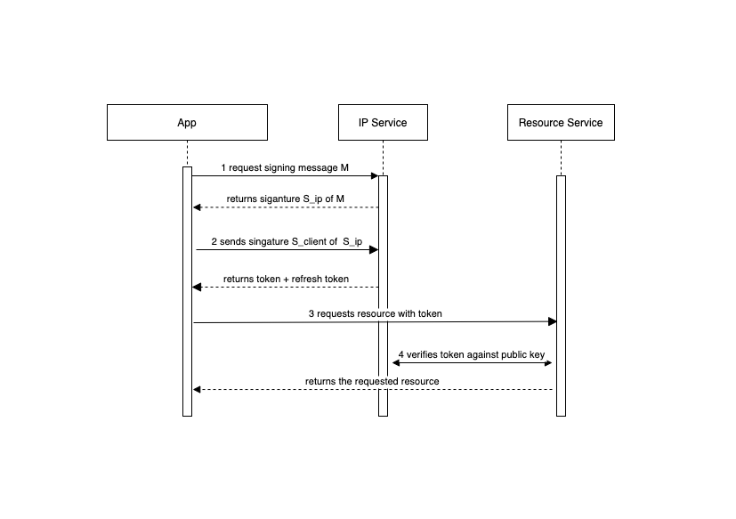

# Basic Flow

This flow expects no browser extension nor an identity mobile app.

NOTE:
The client app (mobile, webapp) are managing the ERC725Key by themselves. So the 
browser extension (MetaMask, Universal Profile Extension,...) are omitted here.

The flow uses a signed JWT token. The resource service will need to validate
the token against the public key of the certificate.

Note: Use a OIDC library to validate the token as they cache the public key
and manage cache invalidation (periodically request the public key from the ip service)

## The Flow

1. [The client requests a signing of a random message M from the IP-Service](#1-request-signing)
2. [The client signs the signature with its ERC725Key and requests a token](#2-request-token)
3. [The client makes a request for a resource](#3-request-resource)
4. [The resource service verifies the token against the IP-Service](#4-verify-token)




### 1 Request Signing

A random message M (in Base64) is send to the IP-Service with the ERC725Address of the universal profile of
the DApp (The IP-Service might manage more than one DApp). The IP-Service responds with
a signature of message M signed with a ERC725Key that has signing rights in the universal profile
ERC725Address.

POST /up/sign

Request
```json
{
  "appERC725Address": "string",
  "message": "string",
  "signaturePrefix": "boolean"
}
```

Response

```json
{
  "appERC725Address": "string",
  "controllerKeyOfApp": "string",
  "message": "string",
  "signature": "string",
  "signaturePrefix": "boolean"
}
```

### 2 Request Token
The client signs the signature of the IP-Service with its own local ERC725Key and
requests a token from the IP-Service. The user is

1. Anonymous - if the erc725Address is left empty
2. A Universal Profile - if the erc725Address is existent and the signing ERC725Key has signing rights in the universal profile of the customer

The client must provide the audience(s). These are usually the domains of the resource service
this token is valid for.

The IP-Service responds with a signed JWT Token.

How to construct the signature:

    signature = keccak(originalSignatureHex.ToByte())

POST /up/token

Request
```json
{
  "audiences": [
    "string"
  ],
  "userERC725Address": "string",
  "message": "string",
  "originalAppSignature": "string",
  "signature": "string",
  "signaturePrefix": "boolean"
}
```

Response

```json
{
  "expiresIn": 0,
  "refreshToken": "string",
  "token": "string",
  "type": "string"
}
```

The JWT token has the standard claims + an additional field for the erc725Address


```json
{
  "erc725Address": "",
  "aud": [
    "http://digital-wardrobe.com"
  ],
  "exp": 1628514375,
  "jti": "de2004af-368c-404b-8f94-2cc341e1c544",
  "iat": 1628514365,
  "iss": "http://35.246.184.226",
  "sub": "0x6c25875C1ddBfE62536be3Ac2D70588C1Dc01E0c"
}
```

The signing alg is

```json
{
  "alg": "RS256",
  "typ": "JWT"
}
```


### 3 Request Resource
The client can make a request at the resource service by adding the token into HTTP
header. The header must be

    Authorization: Bearer [TOKEN]


### 4 Verify Token
The Resource service can validate the token in many ways. As the IP-Service
is OIDC compliant it can use a oidc library to verify the token.

Not recommended but also possible is to call verification endpoint at the IP-Service.
The IP-Service will respond with the UserIdentity(erc725Address + erc726Key)


POST /up/token/verify

Request
```json
{
  "token": "string"
}
```

Response

```json
{
  "erc725Address": "string",
  "erc725ControllerKey": "string"
}
```
 